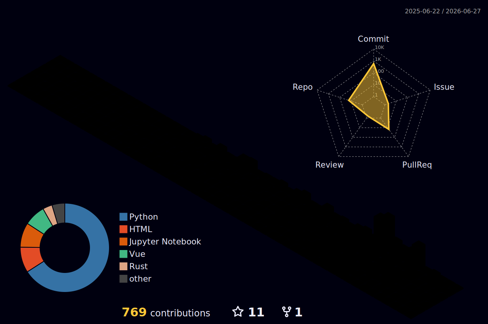

  

  

  
  
  
  

---

<h2>🧑‍💻 About me</h2>

<table>
<tr>
<td width="60%">

- 📍 Bilbao, Spain
- 🎓 Dual BSc **Computer Science + Data Science** @ University of Deusto
- 🔬 Currently working with **LLMs, AI Assistants & Data Processing**
- 🎯 Building intelligent systems that actually work
- 🐛 Creating bugs since 2022
- 🎲 99% success rate fixing bugs... that I created myself

</td>
<td width="40%" align="center">

</td>
</tr>
</table>

---

<h2>⚡ Tech Stack</h2>

**Languages & Core**

 

**Frameworks & Tools**

 

**Data & ML**

 

**Dev Tools**

---

<h2>📊 GitHub Stats</h2>

  
  

---

<h2>🌐 3D Contribution Graph</h2>

  

